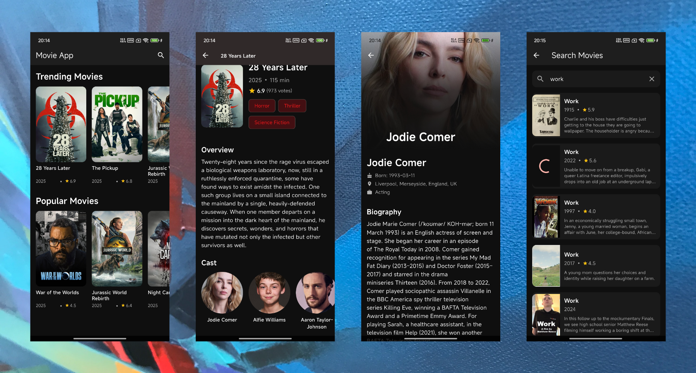

# Movie App

A Flutter application that allows users to explore movies and their cast using data from The Movie DB API.

## Features

- **Movie Browse**: Display trending and popular movies
- **Search Functionality**: Search for movies by title
- **Movie Details**: Show detailed information about selected movies including title, overview, release year, runtime, and cast
- **Actor/Actress Details**: Provide details for specific actors or actresses including their name, biography, birth date, and associated movies
- **State Management**: Uses GetX for state management, dependency injection, and routing
- **Modern UI**: Beautiful and modern UI with custom animations and splash screen

## Screenshots



## Download

[⬇️ Download link: Android APK on pgyer.com](https://www.pgyer.com/tmdb-movie)

## Getting Started

### Prerequisites

- Flutter SDK (3.8.0 or higher)
- Dart SDK
- Android Studio / VS Code / Cursor
- The Movie DB API key (https://www.themoviedb.org/)

### Installation

1. **Clone the repository**

   ```bash
   git clone https://github.com/Fangqv/demo_movie.git
   cd demo_movie
   ```

2. **Get dependencies**

   ```bash
   flutter pub get
   ```

3. **Get your API key**

   - Go to [The Movie DB](https://www.themoviedb.org/)
   - Create an account and request an API key
   - Copy your API key

4. **Configure API key**

   - Copy the `.env.example` file to `.env`:

   ```bash
   cp .env.example .env
   ```

   - Open the `.env` file and replace `your_api_key_here` with your actual API key:

   ```
   TMDB_API_KEY=your_actual_api_key_here
   ```

5. **Run the app**
   ```bash
   flutter run
   ```

## Project Structure

```
lib/
├── main.dart               # App entry point
├── controllers/          # GetX controllers for managing state and business logic
│   ├── splash_controller.dart
│   ├── home_controller.dart
│   ├── movie_details_controller.dart
│   ├── actor_details_controller.dart
│   └── search_controller.dart
├── models/               # Data models and classes
│   ├── movie.dart
│   ├── movie.g.dart
│   ├── actor.dart
│   ├── actor.g.dart
│   ├── movie_details.dart
│   └── movie_details.g.dart
├── services/             # Services for API communication
│   └── api_service.dart
├── theme/                # App theme and styling
│   └── app_theme.dart
├── views/                # UI screens/pages
│   ├── splash/
│   │   └── splash_view.dart
│   ├── home/
│   │   └── home_view.dart
│   ├── movie_details/
│   │   └── movie_details_view.dart
│   ├── actor_details/
│   │   └── actor_details_view.dart
│   └── search/
│       └── search_view.dart
├── widgets/              # Reusable UI components
│   ├── movie_card.dart
│   ├── actor_card.dart
│   └── loading_shimmer.dart
├── routes/               # App routing configuration
│   ├── app_routes.dart
│   └── app_pages.dart
├── l10n/                 # Localization files
│   └── intl_*.arb
└── gen/                  # Generated files (e.g., localization)
    └── l10n.dart
```

## Dependencies

- **get**: For state management, dependency injection, and routing.
- **http**: For making HTTP requests to The Movie DB API.
- **flutter_dotenv**: For loading environment variables from a `.env` file.
- **cached_network_image**: To cache and display network images efficiently.
- **shimmer**: To add a shimmering effect while loading data.
- **intl**: For internationalization and localization.
- **json_annotation**: For JSON serialization and deserialization.
- **flutter_native_splash**: For creating a native splash screen.

### Dev Dependencies

- **build_runner**: A tool to generate files.
- **json_serializable**: To generate JSON serialization/deserialization code.
- **flutter_lints**: For static analysis to find possible errors.
- **icons_launcher**: To automatically generate app icons.

## API Endpoints Used

- `GET /trending/movie/week` - Get trending movies for the week.
- `GET /movie/popular` - Get a list of popular movies.
- `GET /search/movie` - Search for movies by title.
- `GET /movie/{movie_id}` - Get the primary information about a movie.
- `GET /movie/{movie_id}/credits` - Get the cast and crew for a movie.
- `GET /person/{person_id}` - Get the primary information about a person.
- `GET /person/{person_id}/movie_credits` - Get the movie credits for a person.

## Architecture

This project follows the principles of **Clean Architecture** tailored for a Flutter environment using GetX. The structure separates concerns into distinct layers:

- **Views**: The UI layer, composed of widgets that display data and capture user input. It's responsible for the "what to show" part.
- **Controllers (GetX)**: Act as presenters or view models. They fetch data from services, manage the state of the UI, and handle the business logic associated with a particular screen.
- **Services**: Responsible for external interactions, such as fetching data from the network (e.g., `ApiService`). They abstract the data sources from the rest of the app.
- **Models**: Plain Dart objects that represent the data structure of the application (e.g., `Movie`, `Actor`). They are used across different layers.
- **Routes**: Manages navigation and screen transitions within the app.

This separation ensures that the codebase is modular, scalable, and easy to maintain.

## State Management

State management is handled using the **GetX** package, which provides a simple and powerful solution.

- **Reactive State Management**: `Obx` widgets are used to listen to changes in observable variables (`.obs`) within the controllers. The UI automatically rebuilds when the state changes, ensuring it's always in sync.
- **Dependency Injection**: GetX's dependency injection system (`Get.put()`, `Get.find()`) is used to provide instances of controllers and services throughout the app. This decouples the classes and makes them easier to test.
- **Route Management**: Navigation is simplified with GetX's routing APIs (`Get.toNamed()`, `Get.back()`, etc.), which allows for easy navigation without needing `BuildContext`.

## License

This project is licensed under the MIT License. See the `LICENSE.md` file for details.

## Acknowledgments

- [The Movie DB (TMDb)](https://www.themoviedb.org/) for providing the free API.
- The [Flutter](https://flutter.dev/) and [Dart](https://dart.dev/) teams.
- The creator of the [GetX](https://pub.dev/packages/get) package.
